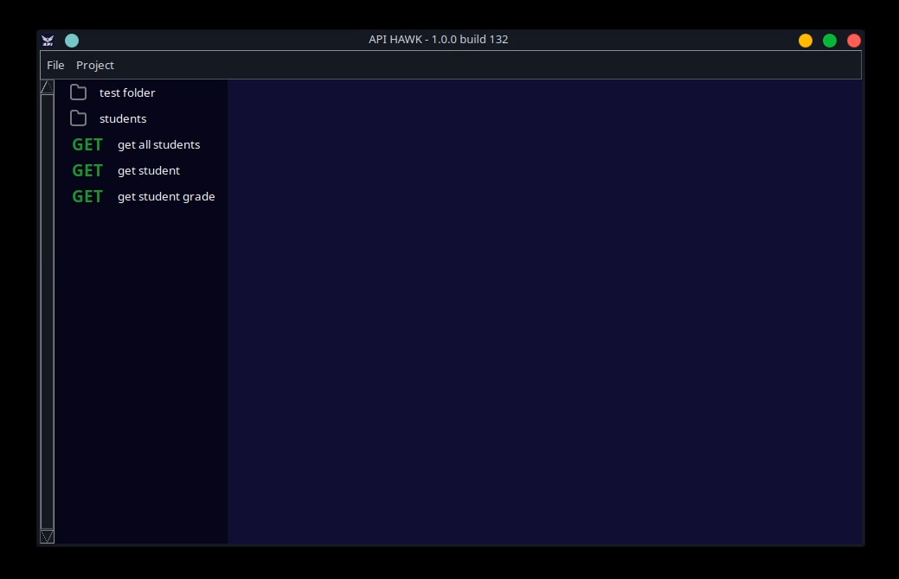

# API Hawk

## What is API Hawk
API Hawk is a user-friendly REST client made using tkinter.
It is designed to be as simple to use as possible
and look extremely minimalistic.

End points can be organized in a folder structure,
and projects can be save and loaded to save files to be easily transfered between
computers and stored on the version control of your API

